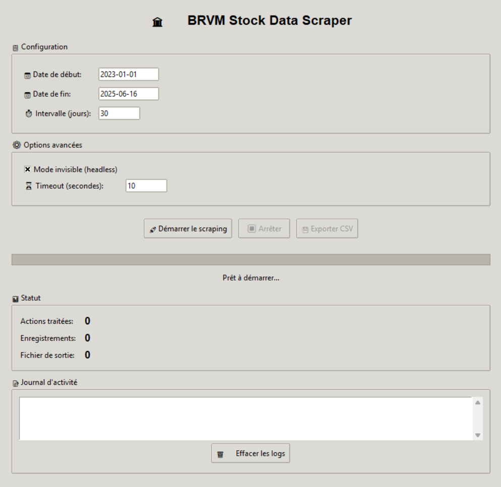

# 🏛️ BRVM Stock Data Scraper

[](https://www.python.org/)
[](https://selenium.dev/)
[](LICENSE)

Un outil complet de scraping des données boursières de la BRVM (Bourse Régionale des Valeurs Mobilières) avec interface graphique moderne et fonctionnalités avancées.

## 📋 Table des matières

- [Aperçu](#-aperçu)
- [Fonctionnalités](#-fonctionnalités)
- [Installation](#-installation)
- [Utilisation](#-utilisation)
- [Configuration](#-configuration)
- [Structure du projet](#-structure-du-projet)
- [Données collectées](#-données-collectées)
- [Dépannage](#-dépannage)
- [Contribution](#-contribution)
- [Licence](#-licence)

## 🔍 Aperçu

Ce projet permet d'extraire automatiquement les données historiques des actions cotées à la BRVM via le site SikaFinance. Il propose deux modes d'utilisation :

- **Mode console** : Script Python autonome pour l'automatisation
- **Mode graphique** : Interface utilisateur intuitive avec Tkinter

### Capture d'écran

```

```

## ✨ Fonctionnalités

### 🎯 Scraping intelligent
- **Multi-actions** : Collecte automatique de toutes les actions disponibles
- **Gestion des périodes** : Division intelligente des plages de dates
- **Détection des données** : Évite les requêtes inutiles
- **Gestion d'erreurs** : Récupération automatique et continuation

### 🖥️ Interface graphique
- **Configuration visuelle** : Paramétrage facile des dates et options
- **Suivi en temps réel** : Barre de progression et statuts détaillés
- **Journal intégré** : Logs complets avec horodatage
- **Export flexible** : Sauvegarde personnalisée des données

### 🔧 Options avancées
- **Mode invisible** : Scraping en arrière-plan (headless)
- **Timeouts configurables** : Adaptation aux conditions réseau
- **Sauvegarde automatique** : Protection contre les pertes de données
- **Post-traitement** : Nettoyage et tri automatiques

## 🚀 Installation

### Prérequis
- Python 3.7 ou supérieur
- Chrome ou Chromium installé
- Connexion Internet stable

### Installation

```bash
# Cloner le repository
git clone https://github.com/OlivierGBONOU/Brvm-Scraper.git
cd Brvm-Scraper

# Lancer l'interface graphique
python brvm_gui.py
```

### Dépendances

```txt
selenium
beautifulsoup4
pandas
webdriver-manager
```

## 📖 Utilisation

### Mode graphique (Recommandé)

```bash
python brvm_gui.py
```

1. **Configurer les paramètres** :
   - Date de début et fin
   - Intervalle de scraping (jours)
   - Options avancées

2. **Lancer le scraping** :
   - Cliquer sur "🚀 Démarrer le scraping"
   - Suivre la progression en temps réel

3. **Exporter les résultats** :
   - Utiliser le bouton "💾 Exporter CSV"
   - Choisir l'emplacement de sauvegarde

### Mode console

```python
from paste import BRVMScraper
from datetime import datetime

# Configuration
scraper = BRVMScraper({
    'headless': True,
    'timeout': 10
})

# Scraping
start_date = datetime(2023, 1, 1)
end_date = datetime.now()
result = scraper.scrape_data(start_date, end_date)

if result['success']:
    print(f"✅ {result['records']} enregistrements collectés")
```

### Script automatisé

```python
# Exemple de script pour automatisation
import schedule
import time
from datetime import datetime, timedelta

def scraping_quotidien():
    scraper = BRVMScraper({'headless': True})
    hier = datetime.now() - timedelta(days=1)
    aujourd_hui = datetime.now()
    
    result = scraper.scrape_data(hier, aujourd_hui)
    print(f"Scraping quotidien: {result}")

# Programmer le scraping quotidien à 18h
schedule.every().day.at("18:00").do(scraping_quotidien)

while True:
    schedule.run_pending()
    time.sleep(3600)  # Vérifier chaque heure
```

## ⚙️ Configuration

### Paramètres du scraper

```python
config = {
    'headless': True,          # Mode invisible
    'timeout': 10,             # Timeout en secondes
    'retry_attempts': 3,       # Tentatives de retry
    'interval_days': 30        # Intervalle par défaut
}
```

### Variables d'environnement

### Configuration avancée

```python
# Options Chrome personnalisées
options = webdriver.ChromeOptions()
options.add_argument("--no-sandbox")
options.add_argument("--disable-dev-shm-usage")
options.add_argument("--disable-gpu")
options.add_argument("--window-size=1920,1080")
```

## 📁 Structure du projet

```
brvm-scraper/
├── BRVM_scraper.py       # Script de scraping principal
├── brvm_gui.py           # Interface graphique
├── README.md             # Documentation
├── data/                 # Dossier des données
│   ├── stock_data.csv    # Données finales
│   └── stock_data_temp.csv # Sauvegarde temporaire
└── logs/                 # Journaux d'exécution
    └── scraping.log
```

### Fichiers générés

- `stock_data.csv` : Données principales nettoyées
- `stock_data_temp.csv` : Sauvegarde pendant le scraping
- `stock_data_fallback.csv` : Sauvegarde d'urgence en cas d'erreur

## 📊 Données collectées

### Colonnes disponibles

| Colonne | Description | Exemple |
|---------|-------------|---------|
| Date | Date de la séance | 15/06/2024 |
| Ouverture | Prix d'ouverture | 1250.00 |
| Plus Haut | Prix maximum | 1280.00 |
| Plus Bas | Prix minimum | 1240.00 |
| Clôture | Prix de clôture | 1275.00 |
| Volume | Nombre de titres | 15420 |
| Capitalisation | Capitalisation boursière | 2500000000 |
| ACTION | Code de l'action | BICC |

### Format des données

```csv
Date,Ouverture,Plus Haut,Plus Bas,Clôture,Volume,Capitalisation,ACTION
15/06/2024,1250.00,1280.00,1240.00,1275.00,15420,2500000000,BICC
14/06/2024,1245.00,1255.00,1235.00,1250.00,12580,2450000000,BICC
```

### Statistiques exemple

- **Actions disponibles** : ~40 titres
- **Période couverte** : Depuis 2010
- **Fréquence** : Données quotidiennes
- **Volume typique** : 50 000 - 100 000 enregistrements/an

## 🔧 Dépannage

### Problèmes courants

#### 1. ChromeDriver non trouvé
```bash
# Solution : Installation automatique via webdriver-manager
# Incluse dans le script, aucune action requise
```

#### 2. Timeout de connexion
```python
# Augmenter le timeout dans la configuration
config = {'timeout': 30}  # Au lieu de 10
```

#### 3. Captcha ou blocage
```python
# Utiliser des délais plus longs entre les requêtes
time.sleep(random.uniform(2, 5))
```

#### 4. Données manquantes
```python
# Vérifier les logs pour identifier les périodes problématiques
# Le script reprend automatiquement les périodes échouées
```

### Messages d'erreur

| Erreur | Cause | Solution |
|--------|-------|----------|
| `ElementNotFound` | Page non chargée | Augmenter timeout |
| `NoDataFound` | Période sans données | Normal, continuer |
| `ConnectionError` | Problème réseau | Vérifier connexion |
| `ChromeDriverError` | Driver incompatible | Redémarrer le script |

### Optimisation des performances

```python
# Configuration optimale pour gros volumes
config = {
    'headless': True,         # Plus rapide
    'timeout': 15,            # Équilibre stabilité/vitesse
    'interval_days': 7,       # Requêtes plus petites
    'retry_attempts': 2       # Moins d'attente
}
```

## 📈 Utilisation avancée

### Analyse des données

```python
import pandas as pd
import matplotlib.pyplot as plt

# Charger les données
df = pd.read_csv('stock_data.csv')
df['Date'] = pd.to_datetime(df['Date'], format='%d/%m/%Y')

# Analyse par action
for action in df['ACTION'].unique():
    action_data = df[df['ACTION'] == action]
    plt.figure(figsize=(12, 6))
    plt.plot(action_data['Date'], action_data['Clôture'])
    plt.title(f'Évolution du cours - {action}')
    plt.show()
```

### Intégration dans un pipeline

```python
# Exemple d'intégration avec Apache Airflow
from airflow import DAG
from airflow.operators.python_operator import PythonOperator

def daily_scraping():
    scraper = BRVMScraper({'headless': True})
    # Logique de scraping...

dag = DAG('brvm_daily_scraping', schedule_interval='@daily')
scraping_task = PythonOperator(
    task_id='scrape_brvm',
    python_callable=daily_scraping,
    dag=dag
)
```

### Export vers base de données

```python
import sqlite3

def save_to_database(csv_file):
    conn = sqlite3.connect('brvm_data.db')
    df = pd.read_csv(csv_file)
    df.to_sql('stock_prices', conn, if_exists='append', index=False)
    conn.close()
```

## 🤝 Contribution

### Guide de contribution

1. **Fork** le projet
2. **Créer** une branche feature (`git checkout -b feature/AmazingFeature`)
3. **Commit** vos changements (`git commit -m 'Add AmazingFeature'`)
4. **Push** vers la branche (`git push origin feature/AmazingFeature`)
5. **Ouvrir** une Pull Request

### Standards de code

- **PEP 8** pour le style Python
- **Docstrings** pour toutes les fonctions
- **Tests unitaires** pour les nouvelles fonctionnalités
- **Documentation** mise à jour

### Signaler un bug

Utilisez les Issues GitHub avec :
- Description détaillée du problème
- Étapes pour reproduire
- Configuration système
- Logs d'erreur

## Version 1.0.0 (2024-06-16)